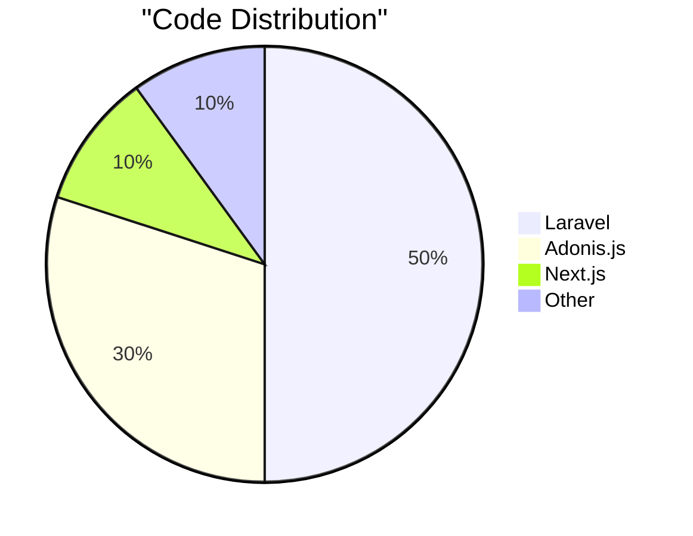

# 👋 Hi, I'm Mitesh Viras

## 💻 Full Stack Developer | PHP/Laravel Expert | Node.js Enthusiast

[](https://linkedin.com/in/mitesh-viras)
[](https://x.com/mitesh_viras)
[](mailto:virashmitesh@gmail.com)

Passionate Full Stack Developer with a love for clean code and innovative solutions. Specialized in Laravel and Adonis.js, with a track record of delivering high-quality, scalable web applications.

### 🚀 Project Portfolio Overview

📊 **Project Delivery Stats:**
- **11+ Projects Delivered** from scratch
- **5 Ongoing Projects**

🛠️ **Tech Stack Breakdown:**
- 7 Laravel Projects
- 4 Adonis.js Projects
- 1 Next.js Frontend Project
- 4 Others

### 🏆 Notable Projects

1. Saibabatours.com
2. 4psenergyconsultant.com
3. Adonis.js v6 Starter API Kit
4. TheBuilder
5. Digital Restro
6. Streamline Transportation Technologies Inc

> Note: Several projects I've contributed to are under NDAs and cannot be disclosed publicly.

### 💡 Technical Expertise

```
Backend       Frontend        DevOps         Tools
────────      ────────       ───────        ─────── 
Laravel       React          Docker         Git
Adonis.js     Next.js        CI/CD          VS Code
PHP           Tailwind       AWS            Postman
Node.js       JavaScript                    
```

### 📈 GitHub Activity

<div align="center">

[](https://git.io/streak-stats)

</div>



### 🎯 Weekly Coding Breakdown

```
Monday      ▓▓▓▓▓▓▓▓▓▓▓▓▓▓▓▓▓▓▓░░░  80%
Tuesday     ▓▓▓▓▓▓▓▓▓▓▓▓▓▓▓▓░░░░░░  70%
Wednesday   ▓▓▓▓▓▓▓▓▓▓▓▓▓▓▓▓▓▓░░░░  75%
Thursday    ▓▓▓▓▓▓▓▓▓▓▓▓▓▓▓▓▓▓▓▓░░  85%
Friday      ▓▓▓▓▓▓▓▓▓▓▓▓▓▓▓▓▓░░░░░  72%
Saturday    ▓▓▓▓▓▓▓▓▓▓▓▓░░░░░░░░░░  55%
Sunday      ▓▓▓▓▓▓░░░░░░░░░░░░░░░░  30%
```

### 🤝 Let's Connect!
- 📧 Email: virashmitesh@gmail.com
- 🔗 LinkedIn: [linkedin.com/in/mitesh-viras](https://linkedin.com/in/mitesh-viras)

---

<div align="center">


[](https://github.com/miteshviras)

</div>
